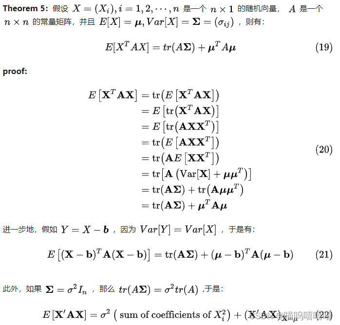

# 多元正态分布的熵(微分熵)

#### 熵

$H(x) = -E_{x\sim P}[log p(x)] = \int p(x)log(p(x)) dx$ 

#### 多元正态分布

$p(x) = \frac{1}{(2\pi)^{n/2}\sqrt {det \Sigma}}exp(-\frac{1}{2}(x-\mu)^{T}\Sigma^{-1}(x-\mu))$

#### 多元正态分布的熵

 

